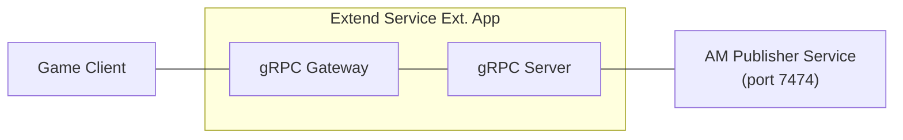

# extend-service-extension-with-am-publisher-python



`AccelByte Gaming Services` (AGS) capabilities can be enhanced using
`Extend Service Extension` apps. An `Extend Service Extension` app is a RESTful
web service created using a stack that includes a `gRPC Server` and the
[gRPC Gateway](https://github.com/grpc-ecosystem/grpc-gateway?tab=readme-ov-file#about).

## Overview

This repository provides a sample `Extend Service Extension` app written in `Python`
that demonstrates integration with the AM (Async Messaging) Publisher service. It
exposes two endpoints:

- **Join** (`POST /v1/admin/namespace/{namespace}/join`) — records a player join event
  by publishing a `PlayerJoined` message to the AM Publisher service.
- **Check** (`GET /v1/admin/namespace/{namespace}/check/{player_id}`) — checks whether
  a player has joined by querying CloudSave for the stored event record.

The app connects to an AM Publisher sidecar running on port `7474` (configurable via
environment variables) and uses CloudSave as the data store for event records.

Additionally, it comes with built-in instrumentation for observability, ensuring that
metrics, traces, and logs are available upon deployment.

## Project Structure

```shell
.
├── proto
│   ├── async_messaging
│   │   └── publisher_service.proto    # AM Publisher gRPC client proto
│   ├── service.proto                  # gRPC server protobuf (Join + Check endpoints)
│   └── ...
├── src
│   ├── accelbyte_grpc_plugin
│   │   ├── interceptors
│   │   │   ├── authorization.py    # gRPC server interceptor for access token validation
│   │   │   └── ...
│   │   └── ...
│   ├── async_messaging               # Generated AM Publisher gRPC stubs
│   ├── app
│   │   ├── __main__.py   # App starts here; sets up AM Publisher gRPC client
│   │   ├── services
│   │   │   ├── my_service.py   # Join and Check endpoint implementations
│   │   │   └── ...
│   │   └── ...
│   └── ...
└── ...
```

## Prerequisites

1. Windows 11 WSL2 or Linux Ubuntu 22.04 or macOS 14+ with the following tools installed:

   a. Bash

      - On Windows WSL2 or Linux Ubuntu:

         ```
         bash --version

         GNU bash, version 5.1.16(1)-release (x86_64-pc-linux-gnu)
         ...
         ```

      - On macOS:

         ```
         bash --version

         GNU bash, version 3.2.57(1)-release (arm64-apple-darwin23)
         ...
         ```

   b. Make

      - On Windows WSL2 or Linux Ubuntu:

         To install from the Ubuntu repository, run `sudo apt update && sudo apt install make`.

         ```
         make --version

         GNU Make 4.3
         ...
         ```

      - On macOS:

         ```
         make --version

         GNU Make 3.81
         ...
         ```

   c. Docker (Docker Desktop 4.30+/Docker Engine v23.0+)

      - On Linux Ubuntu:

         1. To install from the Ubuntu repository, run `sudo apt update && sudo apt install docker.io docker-buildx docker-compose-v2`.
         2. Add your user to the `docker` group: `sudo usermod -aG docker $USER`.
         3. Log out and log back in to allow the changes to take effect.

      - On Windows or macOS:

         Follow Docker's documentation on installing the Docker Desktop on [Windows](https://docs.docker.com/desktop/install/windows-install/) or [macOS](https://docs.docker.com/desktop/install/mac-install/).

         ```
         docker version

         ...
         Server: Docker Desktop
            Engine:
            Version:          24.0.5
         ...
         ```

   d. Python 3.10

      - On Linux Ubuntu:

         To install from the Ubuntu repository, run `sudo apt update && sudo apt install python3 python3-venv`.

      - On Windows or macOS:

         Use the available installer [here](https://www.python.org/downloads/).

         ```
         python3 --version

         Python 3.10.12
         ```

   e. [Postman](https://www.postman.com/)

      - Use binary available [here](https://www.postman.com/downloads/)

   f. [extend-helper-cli](https://github.com/AccelByte/extend-helper-cli)

      - Use the available binary from [extend-helper-cli](https://github.com/AccelByte/extend-helper-cli/releases).

   > :exclamation: In macOS, you may use [Homebrew](https://brew.sh/) to easily install some of the tools above.

2. Access to AGS environment.

   a. Base URL:

      - Sample URL for AGS Shared Cloud customers: `https://spaceshooter.prod.gamingservices.accelbyte.io`
      - Sample URL for AGS Private Cloud customers:  `https://dev.accelbyte.io`

   b. [Create a Game Namespace](https://docs.accelbyte.io/gaming-services/modules/foundations/identity-access/namespaces/manage-your-namespaces/) if you don't have one yet. Keep the `Namespace ID`. Make sure this namespace is in active status.


   c. [Create an OAuth Client](https://docs.accelbyte.io/gaming-services/modules/foundations/identity-access/authorization/manage-access-control-for-applications/#create-an-iam-client) with confidential client type with the following permissions. Keep the `Client ID` and `Client Secret`.

      - For AGS Private Cloud customers:
         - `ADMIN:ROLE [READ]` to validate access token and permissions
         - `ADMIN:NAMESPACE:{namespace}:NAMESPACE [READ]` to validate access namespace
         - `ADMIN:NAMESPACE:{namespace}:CLOUDSAVE:RECORD [CREATE,READ,UPDATE,DELETE]` to create, read, update, and delete cloudsave records
      - For AGS Shared Cloud customers:
         - IAM -> Roles (Read)
         - Basic -> Namespace (Read)
         - Cloud Save -> Game Records (Create, Read, Update, Delete)

3. AM Publisher service running on port `7474`. This is provided as a sidecar alongside
   this app. Set `ASYNC_MESSAGING_PUBLISHER_ENABLED=false` to disable publishing and log
   messages instead (useful for local development without the sidecar).

## Setup

To be able to run this app, you will need to follow these setup steps.

1. Create a docker compose `.env` file by copying the content of
   [.env.template](.env.template) file.

   > :warning: **The host OS environment variables have higher precedence
   compared to `.env` file variables**: If the variables in `.env` file do not
   seem to take effect properly, check if there are host OS environment
   variables with the same name. See documentation about
   [docker compose environment variables precedence](https://docs.docker.com/compose/how-tos/environment-variables/envvars-precedence/)
   for more details.

2. Fill in the required environment variables in `.env` file as shown below.

   ```
   AB_BASE_URL='http://test.accelbyte.io'    # Your environment's domain Base URL
   AB_CLIENT_ID='xxxxxxxxxx'                 # Client ID from the Prerequisites section
   AB_CLIENT_SECRET='xxxxxxxxxx'             # Client Secret from the Prerequisites section
   AB_NAMESPACE='xxxxxxxxxx'                 # Namespace ID from the Prerequisites section
   PLUGIN_GRPC_SERVER_AUTH_ENABLED=true      # Enable or disable access token validation
   BASE_PATH='/guild'                        # The base path used for the app
   ASYNC_MESSAGING_PUBLISHER_ENABLED=true    # Set to false to disable AM publishing (logs instead)
   ASYNC_MESSAGING_PUBLISHER_GRPC_HOST=localhost  # AM Publisher sidecar host
   ASYNC_MESSAGING_PUBLISHER_GRPC_PORT=7474       # AM Publisher sidecar port
   ```

   > :exclamation: **In this app, PLUGIN_GRPC_SERVER_AUTH_ENABLED is `true` by default**: If it is set to `false`, the endpoint access token validation will be disabled and the endpoint can be accessed without a valid access token. This option is provided for development purpose only.

## Building

To build this app, use the following command.

```shell
make build
```

## Running

To (build and) run this app in a container, use the following command.

```shell
docker compose up --build
```

## Testing

### Test in Local Development Environment

This app can be tested locally through the Swagger UI.

1. Run this app by using the command below.

   ```shell
   docker compose up --build
   ```

2. If **PLUGIN_GRPC_SERVER_AUTH_ENABLED** is `true`: Get an access token to
   be able to access the REST API service.

   To get an access token, you can use [get-access-token.postman_collection.json](demo/get-access-token.postman_collection.json) in demo folder.
   Import the Postman collection to your Postman workspace and create a
   Postman environment containing the following variables.

   - `AB_BASE_URL` For example, https://test.accelbyte.io
   - `AB_CLIENT_ID` A confidential IAM OAuth client ID
   - `AB_CLIENT_SECRET` The corresponding confidential IAM OAuth client secret
   - `AB_USERNAME` The username or e-mail of the user (for user token)
   - `AB_PASSWORD` The corresponding user password (for user token)

   Inside the postman collection, use `get-client-access-token` request to get client token or use `get-user-access-token` request to get user access token.

3. The REST API service can then be tested by opening Swagger UI at
   `http://localhost:8000/guild/apidocs/`. Use this to create an API request
   to try the endpoints.

   > :info: Depending on the envar you set for `BASE_PATH`, the service will
   have different service URL. This how it's the formatted
   `http://localhost:8000/<base_path>`

   To authorize Swagger UI, click on "Authorize" button on right side.

   Popup will show, input "Bearer <user access token>" in `Value` field for
   `Bearer (apiKey)`. Then click "Authorize" to save the user's access token.

4. You can also use the Postman collection [demo/service-extension-with-publisher-demo.postman_collection.json](demo/service-extension-with-publisher-demo.postman_collection.json)
   to test the `Join` and `Check` endpoints.

   - Import the collection and configure the following variables in your Postman environment:
     - `AB_BASE_URL`
     - `AB_NAMESPACE`
     - `AB_CLIENT_ID`
     - `AB_CLIENT_SECRET`
     - `EXTEND_APP_SERVICE_URL` (e.g. `http://localhost:8000/guild`)

   - Run `10-client-login` first to obtain an access token.
   - Run `20-player-join` to trigger a join event.
   - Run `30-check` to verify the player has joined (requires the AM Consumer app to have stored the event in CloudSave).

### Test Observability

To be able to see the how the observability works in this sample app locally, there are few things that need be setup before performing tests.

1. Uncomment loki logging driver in [docker-compose.yaml](docker-compose.yaml)

   ```
    # logging:
    #   driver: loki
    #   options:
    #     loki-url: http://host.docker.internal:3100/loki/api/v1/push
    #     mode: non-blocking
    #     max-buffer-size: 4m
    #     loki-retries: "3"
   ```

   > :warning: **Make sure to install docker loki plugin beforehand**: Otherwise,
   this app will not be able to run. This is required so that container
   logs can flow to the `loki` service within `grpc-plugin-dependencies` stack.
   Use this command to install docker loki plugin:
   `docker plugin install grafana/loki-docker-driver:latest --alias loki --grant-all-permissions`.

2. Clone and run [grpc-plugin-dependencies](https://github.com/AccelByte/grpc-plugin-dependencies) stack alongside this app. After this, Grafana
will be accessible at http://localhost:3000.

   ```
   git clone https://github.com/AccelByte/grpc-plugin-dependencies.git
   cd grpc-plugin-dependencies
   docker compose up
   ```

   > :exclamation: More information about [grpc-plugin-dependencies](https://github.com/AccelByte/grpc-plugin-dependencies) is available [here](https://github.com/AccelByte/grpc-plugin-dependencies/blob/main/README.md).

3. Perform testing. For example, by following [Test in Local Development Environment](#test-in-local-development-environment).

## Deploying

After completing testing, the next step is to deploy your app to `AccelByte Gaming Services`.

1. **Create an Extend Service Extension app**

   If you do not already have one, create a new [Extend Service Extension App](https://docs.accelbyte.io/gaming-services/modules/foundations/extend/service-extension/getting-started-service-extension/#create-the-extend-app).

   On the **App Detail** page, take note of the following values.
   - `Namespace`
   - `App Name`

   Under the **Environment Configuration** section, set the required secrets and/or variables.
   - Secrets
      - `AB_CLIENT_ID`
      - `AB_CLIENT_SECRET`

2. **Build and Push the Container Image**

   Use [extend-helper-cli](https://github.com/AccelByte/extend-helper-cli) to build and upload the container image.

   ```
   extend-helper-cli image-upload --login --namespace <namespace> --app <app-name> --image-tag v0.0.1
   ```

   > :warning: Run this command from your project directory. If you are in a different directory, add the `--work-dir <project-dir>` option to specify the correct path.

3. **Deploy the Image**

   On the **App Detail** page:
   - Click **Image Version History**
   - Select the image you just pushed
   - Click **Deploy Image**
